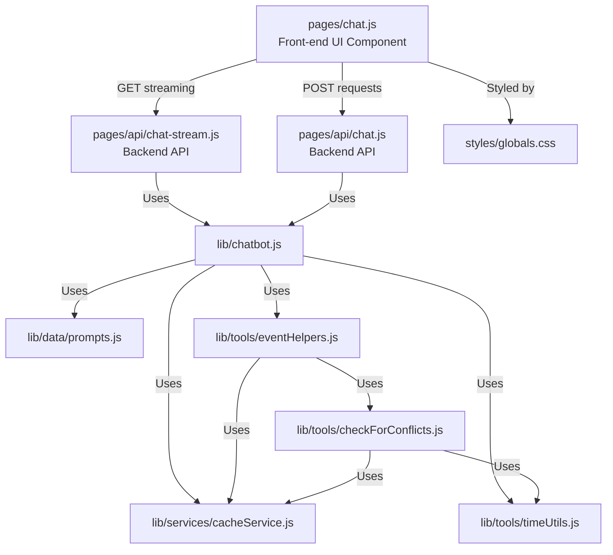

# Front-end Files for the Chat Screen

Based on my analysis of the codebase, here are the front-end files that make up the chat screen functionality:

## Key Distinction Between Files

There's an important distinction between the files in the `pages` directory:

- **`pages/chat.js`**: This is a **front-end React component** that renders the actual chat UI that users see and interact with. In Next.js, files directly in the `pages` directory become routes/pages in your application.

- **`pages/api/chat.js`** and **`pages/api/chat-stream.js`**: These are **backend API endpoints**. In Next.js, files under `pages/api` are treated as API routes that run on the server, not UI components. They handle HTTP requests but don't render any UI.

## Main Front-end Component
- **`pages/chat.js`**: This is the primary React component that renders the chat interface. It includes:
  - User authentication handling with NextAuth
  - Chat message state management
  - Message sending functionality
  - Real-time message streaming using EventSource
  - UI components for displaying messages, loading states, and error handling
  - Responsive design with Tailwind CSS

## Backend API Endpoints Supporting the Chat UI
- **`pages/api/chat-stream.js`**: GET endpoint that handles the streaming chat responses using Server-Sent Events (SSE)
  - Sets up proper headers for streaming
  - Authenticates the user
  - Calls the chatbot service with streaming enabled
  - Handles errors and timeouts

- **`pages/api/chat.js`**: POST endpoint that provides dual-mode chat functionality:
  - Supports both streaming and non-streaming modes
  - In streaming mode: Uses Server-Sent Events similar to chat-stream.js
  - In non-streaming mode: Returns a regular JSON response
  - This provides flexibility for different client implementations or fallback options

## Core Chat Logic
- **`lib/chatbot.js`**: The main service that powers the chat functionality
  - Integrates with OpenAI
  - Manages conversation state
  - Processes tool calls for calendar operations
  - Handles streaming responses
  - Formats messages for display

## Supporting Utility Files
- **`lib/data/prompts.js`**: Contains the system prompt for the AI assistant
- **`lib/tools/eventHelpers.js`**: Utilities for handling calendar events
- **`lib/tools/timeUtils.js`**: Functions for time conversion and timezone handling
- **`lib/services/cacheService.js`**: Caching layer for calendar events
- **`lib/tools/checkForConflicts.js`**: Logic for detecting calendar conflicts

## Styling
- **`styles/globals.css`**: Global CSS styles that are applied to the chat interface

## Architecture Diagram

## Key Features of the Chat UI

1. **Real-time Message Streaming**: The UI shows messages as they're being generated, with visual indicators for streaming and processing states.

2. **Authentication Integration**: The chat screen checks for user authentication and redirects to login if needed.

3. **Error Handling**: Comprehensive error handling for network issues, timeouts, and processing failures.

4. **Calendar Event Visualization**: Special formatting for calendar events with icons and structured display.

5. **Responsive Design**: Uses Tailwind CSS for a mobile-friendly interface.

6. **User Profile Display**: Shows the user's Google profile picture and name in the header.

7. **Dual API Support**: The application has two API endpoints for chat functionality:
   - `chat-stream.js` (GET): Optimized for streaming responses
   - `chat.js` (POST): Flexible endpoint supporting both streaming and non-streaming modes

The chat interface is built as a modern React application with server-side rendering via Next.js, real-time streaming capabilities, and integration with Google Calendar services.